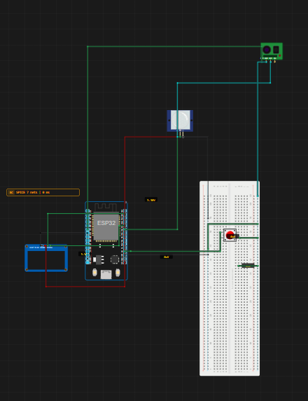

# Github Stats PUller

> Built in [Breadboard](https://breadboard.hackclub.com), a Hack Club program. This project took ~10 hours of work.

## What It Does

Its just a stats puller that can clearly pull my github stats and shows with live commits and other data

## How It Works

The circuit is captured in `breadboard-project.json`, and the firmware that runs it is in the `firmware/` folder.

## How To Use It

First connect the ESP32 and all other things in correct config according to the connection tab.
Then change the github and hac username to your own 
Relace the gh secret to you own personal access token and hackatime toekn also (hc token is optional )

## Demo

- **Simulate it live:** [https://breadboard.hackclub.com/share/106](https://breadboard.hackclub.com/share/106), runs the firmware in the Breadboard simulator
- **View the design:** [https://taniwankenobi.github.io/breadboard-plays/p/106/](https://taniwankenobi.github.io/breadboard-plays/p/106/)

## Schematic

The editor snapshot is in `breadboard-project.json`.

## Bill of Materials

| Part | Quantity |
| --- | --- |
| breadboard-full | 1 |
| obstacle-avoidance-module | 1 |
| pir-motion-sensor | 1 |
| pushbutton | 1 |
| ssd1306-i2c | 1 |

## Firmware

Firmware files are in the `firmware/` folder.

## Build Journal

Build journal entries are kept in [`journals.md`](journals.md).

---

*Made in [Breadboard](https://breadboard.hackclub.com) — 10h of work*

